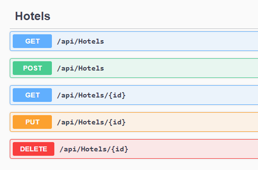
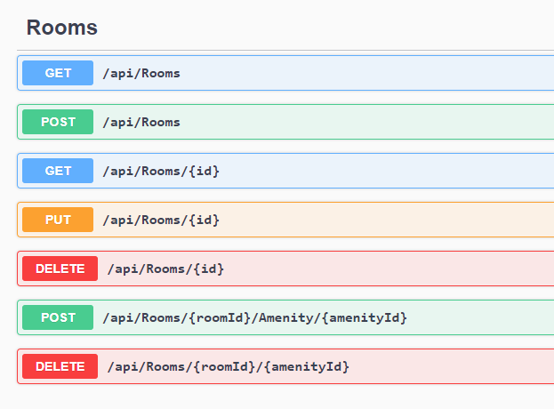
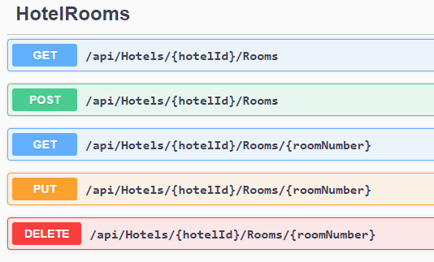
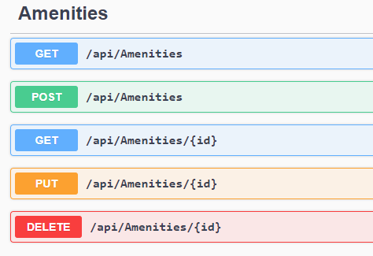
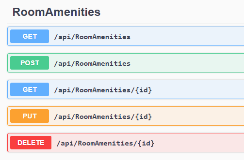
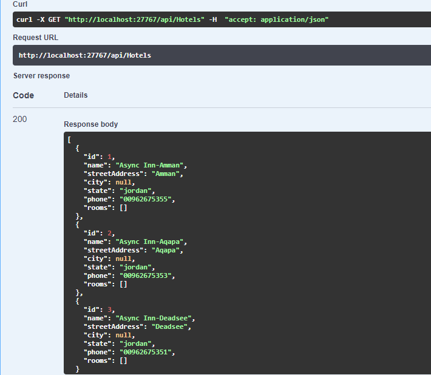

# Async-Inn
 API server for a Hotel Asset Management system 

 Author: Sultan Kanaan

 Lab 11: Databases and ERDs _ 14-4-2022

 Lab 12: Intro to Entity Framework _ 19-4-2022

 Lab 13: Dependency Injection _ 20-4-2022
 
 Lab 14: Navigation Properties & Routing _ 24-4-2022
 
 Lab 16: Data Transfer Objects (DTOs) _ 27-4-2022

---
## architecture :

* in This projetct i have 3 model (Hotels, Rooms, and Amenities).
* and also i have 3 interface for evry model.
* service for each of the controllers that implement the appropriate interface.
* CRUD operations for evry class.
* I Update the Controller to use the appropriate method from the interface rather than the DBContext directly.

---
 # API Routes
 
## Hotel Routes :

.

## Rooms Routes :

## HotelRoom Routes :

## Amenities Routes :

## Room Amenities Routes:

## Tables 

---

## API

