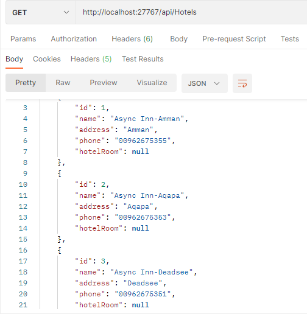

# Async-Inn
 API server for a Hotel Asset Management system 

 Author: Sultan Kanaan

 Lab 11: Databases and ERDs _ 14-4-2022

 Lab 12: Intro to Entity Framework _ 19-4-2022

 Lab 13: Dependency Injection _ 20-4-2022
 
 Lab 14: Navigation Properties & Routing _ 24-4-2022
 
 Lab 16: Data Transfer Objects (DTOs) _ 27-4-2022

---
## architecture :

* in This projetct i have 3 model (Hotels, Rooms, and Amenities).
* and also i have 3 interface for evry model.
* service for each of the controllers that implement the appropriate interface.
* CRUD operations for evry class.
* I Update the Controller to use the appropriate method from the interface rather than the DBContext directly.

---
 ## API Routes
 
- ### Hotel Routes: 
  - GET: api/Hotels - Get a list of all hotels
  - GET: api/Hotels/{hotelId} - Get a hotel by ID
  - PUT: api/Hotels/{hotelId} - Update a hotel by ID
  - POST: api/Hotels - Create a new hotel
  - DELETE: api/Hotels/{hotelId} - Delete a hotel

- ### Rooms Routes
  - GET: api/Rooms - Get a list of all rooms
  - GET: api/Rooms/{id} - Get a room by ID
  - PUT: api/Rooms/{id} - Update a room by ID
  - POST: api/Rooms - Create a new room
  - POST: {roomId}/Amenity/{amenityId} - Add an amenity to a room
  - DELETE: {roomId}/{amenityId} - Delete an amenity from a room
  - DELETE: {roomId} - Delete a room

- ### HotelRoom Routes: 
  - GET: api/HotelRooms - Get a list of all hotelRooms
  - GET: api/HotelRooms/{hotelId}/Rooms/{roomNumber} - Get a hotelRooms by ID
  - PUT: api/HotelRooms/{hotelId}/Rooms/{roomNumber} - Update a hotelRooms by ID
  - POST: api/HotelRooms/"{hotelId}/Rooms - Create a new hotelRooms
  - DELETE: api/HotelRooms/{hotelId}/Rooms/{roomNumber} - Delete a hotelRooms

- ### Amenities Routes
  - GET: api/Amenities - Get a list of all amenities
  - GET: api/Amenities/{id} - Get an amenity by ID
  - PUT: api/Amenities/{id} - Update an amenity by ID
  - POST: api/Amenities - Create a new amenity
  - DELETE: api/Amenities/{id} - Delete an amenity by ID

## Tables 

---

## API

